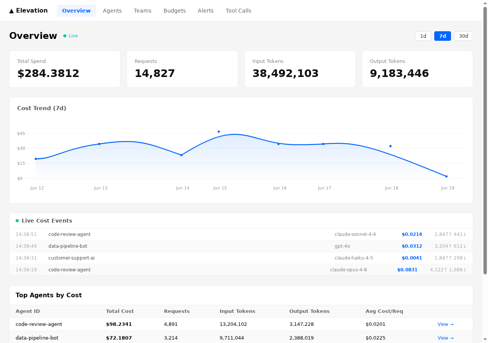
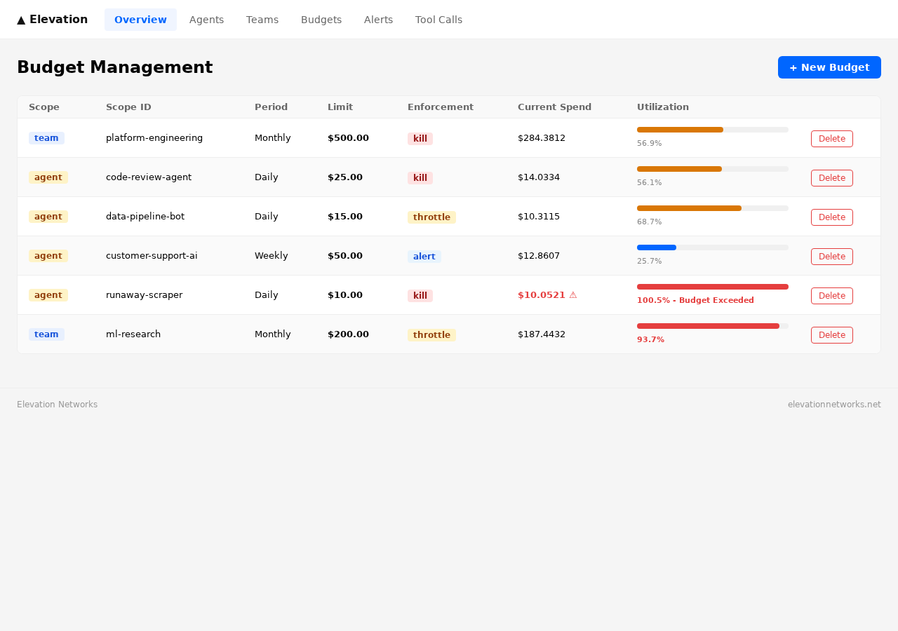
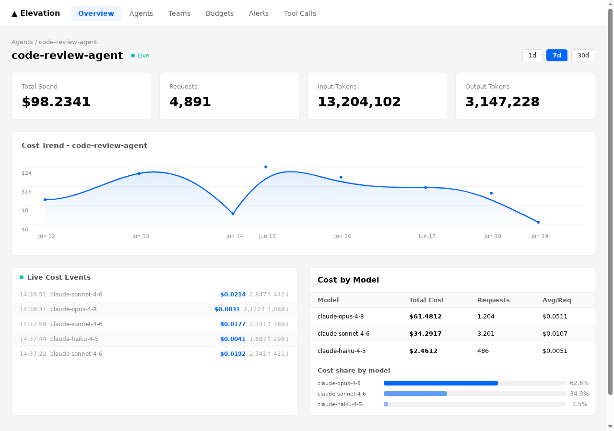

# SteadIO: Never get a surprise AI bill again

[](https://github.com/steadioai/steadio/actions/workflows/ci.yml)
[](./LICENSE)
[](https://github.com/steadioai/steadio/releases)

**Never get a surprise AI bill again.** Drop-in LLM proxy with per-agent cost attribution and hard budget enforcement.

> "Our costs have more than tripled since November of '25." - Chamath Palihapitiya on his AI startup's spend. Runaway agents can rack up $50,000 overnight. SteadIO stops them at the source.

## What it does

Point your agents at `http://localhost:3001/openai` instead of OpenAI directly. SteadIO:

1. **Tags every request** with agent ID and team ID
2. **Counts tokens and costs** in real time using provider-accurate pricing
3. **Enforces budget caps**: returns HTTP 402 and kills the agent the moment it exceeds its limit
4. **Stores attribution data** in PostgreSQL so you can pinpoint exactly which agent caused a cost spike

Works with OpenAI and Anthropic. Streaming supported. One environment variable to instrument.

## Screenshots

**Cost overview** - per-agent spend, 7-day trend, and live request feed:



**Budget enforcement** - set hard caps per agent or team, with kill/throttle/alert modes:



**Agent detail** - drill into any agent for per-model cost breakdown and real-time events:



## Architecture

```
Your Agent ──→ SteadIO Proxy ──→ LLM Provider (OpenAI / Anthropic)
                    │
                    ↓ (async, fire-and-forget)
              Cost Engine (PostgreSQL + Redis)
                    │
                    ↓
              Dashboard (React)
```

The proxy sits on the hot path: auth, tagging, and budget check run synchronously against Redis (<1ms overhead). Cost attribution is fire-and-forget to keep p99 latency clean.

## 5-Minute Setup

### 0. One-command demo (no API keys needed)

```bash
git clone https://github.com/steadioai/steadio
cd steadio
make demo
```

This starts all services and seeds sample multi-agent cost data so the dashboard is populated immediately.

### 1. Clone and start the stack

```bash
git clone https://github.com/steadioai/steadio
cd steadio
docker compose up -d
```

Starts proxy (3001), cost engine (3002), dashboard (5173), PostgreSQL, and Redis.

### 2. Create an API key

```bash
curl -s -X POST http://localhost:3002/api/keys \
  -H "Content-Type: application/json" \
  -d '{"teamId": "myteam", "name": "dev key"}'
```

Save the `key` value from the response — it is only shown once.

### 3. Point your agent at the proxy

**OpenAI:**
```bash
export OPENAI_BASE_URL=http://localhost:3001/openai
```

**Anthropic:**
```bash
export ANTHROPIC_BASE_URL=http://localhost:3001/anthropic
```

Add two headers to identify your agent:
```
X-SteadIO-Key: el_<teamId>_<apiKey>
X-Agent-Id: my-agent
X-Team-Id: my-team
```

No other code changes. Your existing SDK calls pass through unchanged.

### 4. Set a budget cap

```bash
curl -X POST http://localhost:3002/api/budgets \
  -H "Content-Type: application/json" \
  -d '{
    "scope": "agent",
    "scopeId": "my-agent",
    "period": "daily",
    "capUsd": 10.00,
    "enforcementMode": "kill"
  }'
```

When the agent hits $10, the proxy returns HTTP 402:

```json
{
  "error": "budget_exceeded",
  "agent_id": "my-agent",
  "cap_amount": 10.00,
  "current_spend": 10.05,
  "reset_at": "2026-06-18T00:00:00.000Z"
}
```

The agent stops. You don't get the bill.

### 5. Open the dashboard

`http://localhost:5173` - real-time cost breakdown by agent and team.


## Packages

| Package | Port | Purpose |
|---|---|---|
| `@steadio/proxy` | 3001 | Drop-in LLM proxy: tagging, budget check, streaming |
| `@steadio/cost-engine` | 3002 | Cost attribution, budget enforcement, runaway detection |
| `@steadio/dashboard` | 5173 | React dashboard for cost/budget visibility |
| `@steadio/shared` | - | Shared types and pricing tables |

## Supported Providers

| Provider | Models |
|---|---|
| OpenAI | gpt-4o, gpt-4o-mini, gpt-4-turbo, gpt-3.5-turbo |
| Anthropic | claude-opus-4-8, claude-sonnet-4-6, claude-haiku-4-5, claude-3-5-sonnet |
| Google (roadmap) | gemini-1.5-pro, gemini-1.5-flash, gemini-2.0-flash |

Prefix matching handles versioned model names (e.g. `gpt-4o-2024-08-06` → `gpt-4o`).

## Budget Enforcement Modes

| Mode | Behavior |
|---|---|
| `kill` | Returns HTTP 402 immediately when cap is hit |
| `warn` | Allows request, fires alert at `warningThresholdPercent` |

Budget scopes: `agent`, `team`. Periods: `daily`, `weekly`, `monthly`.

## Why a proxy instead of SDK instrumentation?

**SDK wrappers drift.** Every provider library update can break your cost tracking. A proxy is provider-agnostic and survives model version bumps without code changes.

**The proxy stops requests before they reach the provider.** SDK-level hooks fire after the network call returns, which is too late if an agent is already in a runaway loop burning tokens.

**Language-agnostic.** One environment variable. Works with Python, TypeScript, Go, or anything that makes HTTP calls.

## How SteadIO compares

|  | SteadIO | Langfuse | Native provider billing |
|---|---|---|---|
| Per-agent cost attribution | Yes | Yes (with SDK) | No |
| Hard budget enforcement | Yes (HTTP 402) | No | No |
| Runaway detection + circuit break | Yes | No | No |
| Language-agnostic (env var only) | Yes | No (SDK per language) | N/A |
| Self-hosted | Yes | Yes | No |
| Streaming support | Yes | Yes | N/A |
| Real-time dashboard | Yes | Yes | Limited |
| Setup | `docker compose up` | Deploy + instrument | Sign up |

Langfuse is excellent for tracing and observability. SteadIO is the layer that **stops runaway agents before they generate a surprise bill**.

## Development

```bash
pnpm install
pnpm --filter @steadio/shared build
pnpm --filter @steadio/proxy dev
pnpm --filter @steadio/cost-engine dev
pnpm --filter @steadio/dashboard dev
```

## Testing

```bash
pnpm --filter @steadio/proxy test
pnpm --filter @steadio/cost-engine test
```

## Contributing

See [CONTRIBUTING.md](./CONTRIBUTING.md) for local setup, architecture walkthrough, and PR guidelines.

## Support

Questions, bug reports, and feature requests: [GitHub Issues](https://github.com/steadioai/steadio/issues)

## License

[MIT](./LICENSE)
