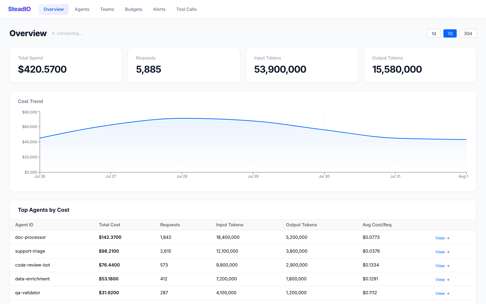
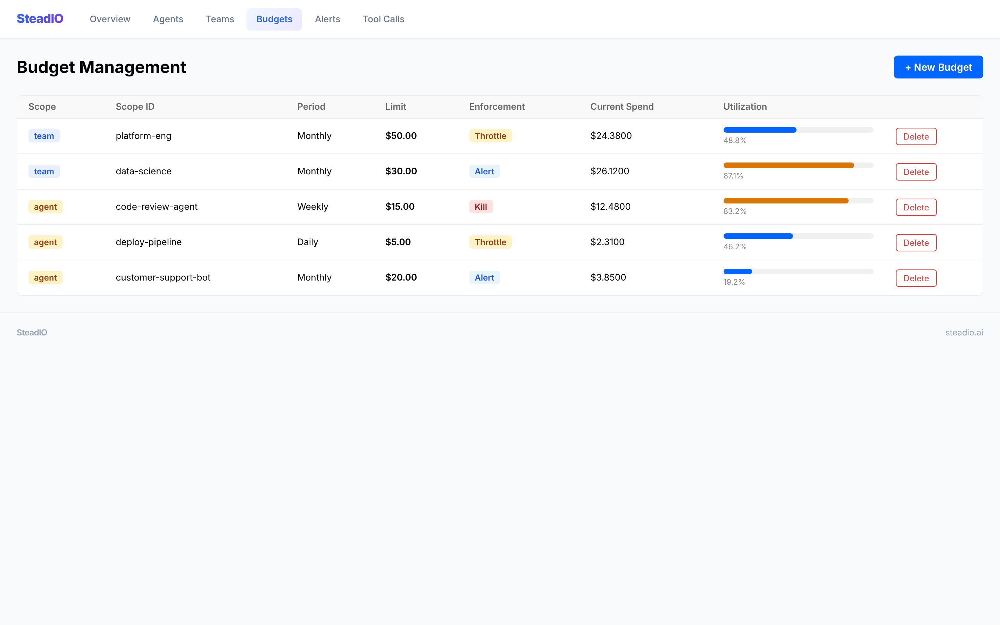
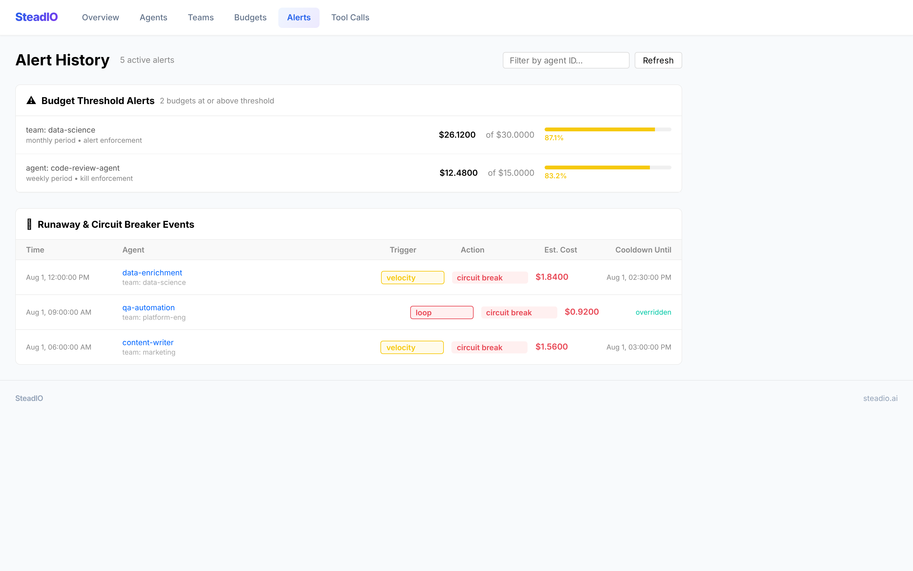

# SteadIO: Reliability for AI agents in production

[](https://github.com/steadioai/steadio/actions/workflows/ci.yml)
[](./LICENSE)
[](https://github.com/steadioai/steadio/releases)

**Reliability for AI agents in production.** SteadIO is a self-hosted LLM proxy and control plane. One base URL change puts every model call under your control: runaway detection, circuit breaking, and hard budget enforcement, with per-agent cost attribution so you can see exactly what happened.

> A single runaway agent can loop for hours and rack up $50,000 overnight before anyone notices. SteadIO catches it at the source: it detects the runaway, opens a circuit breaker, and stops the agent before the damage compounds.

## What it does

Point your agents at `http://localhost:3001/openai` instead of OpenAI directly. SteadIO sits on the hot path and keeps agents inside their guardrails:

1. **Detects runaway agents** by token velocity (spikes above the rolling average) and by repeated identical prompts (loop detection)
2. **Opens a circuit breaker** the moment an agent runs away, returning HTTP 429 until a cooldown expires, before any budget cap is even set
3. **Enforces hard budget caps**: returns HTTP 402 and stops the agent the moment it exceeds its limit
4. **Attributes every request** to an agent and team, counting tokens and costs in real time with provider-accurate pricing, stored in PostgreSQL

Works with OpenAI and Anthropic. Streaming supported. One environment variable to instrument.

## Screenshots

**Cost overview** — total spend, request volume, cost trend, and per-agent attribution at a glance:



**Budget enforcement** — hard caps per agent or team with utilization tracking and kill/warn modes:



**Runaway detection** — circuit breaker events with velocity and loop triggers, cooldown timers, and override history:



## Architecture

```
Your Agent ──> SteadIO Proxy ──> LLM Provider (OpenAI / Anthropic)
                    |
                    | (async, fire-and-forget)
                    v
              Control Engine (PostgreSQL + Redis)
                    |
                    v
              Dashboard (React)
```

The proxy sits on the hot path: auth, tagging, runaway check, and budget check run synchronously against Redis (<1ms overhead). Cost attribution is fire-and-forget to keep p99 latency clean.

## Quick Start

### Option A: Zero-config demo (no API keys needed)

```bash
git clone https://github.com/steadioai/steadio
cd steadio
make demo
```

Starts all services, seeds historical data across 2 teams and 6 agents, and launches a synthetic traffic generator that keeps posting new events every 5 seconds. Open `http://localhost:5173` to see live attribution and controls immediately.

When done: `make clean`

---

### Option B: Manual integration (5 steps)

**1. Start the stack**

```bash
git clone https://github.com/steadioai/steadio
cd steadio
docker compose up -d
```

Starts proxy (3001), control engine (3002), dashboard (5173), PostgreSQL, and Redis.

**2. Create an API key**

```bash
curl -s -X POST http://localhost:3002/api/keys \
  -H "Content-Type: application/json" \
  -d '{"teamId": "myteam", "name": "dev key"}'
```

Save the `key` value. It is only shown once.

**3. Point your agent at the proxy**

Set the base URL to the SteadIO proxy and add two identification headers:

**OpenAI:**
```bash
export OPENAI_BASE_URL=http://localhost:3001/openai
```

**Anthropic:**
```bash
export ANTHROPIC_BASE_URL=http://localhost:3001/anthropic
```

Add these headers to every request (or set them in your SDK client config):

| Header | Value | Purpose |
|---|---|---|
| `X-SteadIO-Key` | `el_myteam_<suffix>` | Authenticates to SteadIO |
| `X-Agent-Id` | `my-agent` | Tags the request for attribution and per-agent controls |

Your existing provider `Authorization` / `x-api-key` headers pass through to the upstream unchanged. No other code changes.

**4. Set a budget cap**

```bash
curl -X POST http://localhost:3002/api/budgets \
  -H "Content-Type: application/json" \
  -d '{
    "scope": "agent",
    "scopeId": "my-agent",
    "period": "daily",
    "capUsd": 10.00,
    "enforcementMode": "kill"
  }'
```

When the agent hits $10, the proxy returns HTTP 402:

```json
{
  "error": "budget_exceeded",
  "agent_id": "my-agent",
  "cap_amount": 10.00,
  "current_spend": 10.05,
  "reset_at": "2026-06-18T00:00:00.000Z"
}
```

The agent stops. You don't get the bill.

**5. Open the dashboard**

`http://localhost:5173` for a real-time breakdown of reliability events and cost by agent and team.


## Framework Examples

Working integration examples for the most popular AI frameworks are in [`examples/`](./examples/):

| Example | Framework | Setup |
|---|---|---|
| [`examples/openai-python/`](./examples/openai-python/) | OpenAI Python SDK | `base_url` + two headers |
| [`examples/langchain/`](./examples/langchain/) | LangChain | `openai_api_base` + `default_headers` on `ChatOpenAI` |
| [`examples/llamaindex/`](./examples/llamaindex/) | LlamaIndex | Custom `openai.OpenAI` client passed to LlamaIndex |
| [`examples/multi-agent/`](./examples/multi-agent/) | Any framework | Per-agent `X-Agent-Id` for attribution by agent |

All examples work against the demo instance (`make demo`) and require a real OpenAI API key for upstream calls.

## Reliability Controls

SteadIO's job is to keep production agents inside their guardrails. Three controls run on the hot path:

**Runaway detection.** The engine watches token velocity (a spike above the rolling average) and repeated identical prompts (loop detection). Either signal marks an agent as running away.

**Circuit breaking.** When an agent runs away, SteadIO opens a circuit breaker and returns HTTP 429 until a cooldown expires. This fires before any budget cap is set, so a loop is stopped even without a configured limit:

```json
{
  "error": "circuit_open",
  "agent_id": "my-agent",
  "reason": "velocity",
  "retry_after": "2026-06-18T01:00:00.000Z"
}
```

You can inspect and reset circuit state from the dashboard.

**Budget enforcement.** Hard caps by scope and period. When a cap is hit, `kill` mode returns HTTP 402 and stops the agent; `warn` mode allows the request and fires an alert at `warningThresholdPercent`.

| Setting | Options |
|---|---|
| Budget scopes | `agent`, `team` |
| Budget periods | `daily`, `weekly`, `monthly` |
| Enforcement modes | `kill` (HTTP 402), `warn` (alert) |

## Cost Attribution

Every request is tagged with agent ID and team ID, priced with provider-accurate tables, and stored in PostgreSQL so you can pinpoint exactly which agent drove a spike. Prefix matching handles versioned model names automatically, so `claude-3-5-sonnet-20241022` resolves to `claude-3-5-sonnet` pricing with no code changes when providers ship new versions.

## Supported Providers

| Provider | Models |
|---|---|
| OpenAI | gpt-4o, gpt-4o-mini, gpt-4-turbo, gpt-3.5-turbo |
| Anthropic | claude-opus-4-8, claude-sonnet-4-6, claude-haiku-4-5, claude-3-5-sonnet, claude-3-5-haiku |
| Google (roadmap) | gemini-1.5-pro, gemini-1.5-flash, gemini-2.0-flash |

## Packages

| Package | Port | Purpose |
|---|---|---|
| `@steadio/proxy` | 3001 | Drop-in LLM proxy: tagging, runaway check, budget check, streaming |
| `@steadio/cost-engine` | 3002 | Attribution, budget enforcement, runaway detection, circuit breaking |
| `@steadio/dashboard` | 5173 | React dashboard for reliability and cost visibility |
| `@steadio/shared` | - | Shared types and pricing tables |

## Why a proxy instead of SDK instrumentation?

**The proxy stops requests before they reach the provider.** SDK-level hooks fire after the network call returns, which is too late if an agent is already in a runaway loop burning tokens. A proxy can break the circuit on the way out.

**SDK wrappers drift.** Every provider library update can break your instrumentation. A proxy is provider-agnostic and survives model version bumps without code changes.

**Language-agnostic.** One environment variable. Works with Python, TypeScript, Go, or anything that makes HTTP calls.

## How SteadIO compares

|  | SteadIO | Langfuse | Native provider billing |
|---|---|---|---|
| Runaway detection + circuit break | Yes | No | No |
| Hard budget enforcement | Yes (HTTP 402) | No | No |
| Per-agent cost attribution | Yes | Yes (with SDK) | No |
| Language-agnostic (env var only) | Yes | No (SDK per language) | N/A |
| Self-hosted | Yes | Yes | No |
| Streaming support | Yes | Yes | N/A |
| Real-time dashboard | Yes | Yes | Limited |
| Setup | `docker compose up` | Deploy + instrument | Sign up |

Langfuse is excellent for tracing and observability. SteadIO is the layer that keeps agents reliable in production: it stops a runaway before it compounds, and attributes every request so you know what happened.

## Roadmap

- **Retries and provider fallback** on upstream errors and timeouts
- **Per-team credential isolation** in the proxy (see the [key-isolation demo](https://github.com/steadioai/llm-gateway-key-isolation-demo))
- **Google / Gemini** provider support

## Development

```bash
pnpm install
pnpm --filter @steadio/shared build
pnpm --filter @steadio/proxy dev
pnpm --filter @steadio/cost-engine dev
pnpm --filter @steadio/dashboard dev
```

## Testing

```bash
pnpm --filter @steadio/proxy test
pnpm --filter @steadio/cost-engine test
```

## Contributing

See [CONTRIBUTING.md](./CONTRIBUTING.md) for local setup, architecture walkthrough, and PR guidelines.

## Support

Questions, bug reports, and feature requests: [GitHub Issues](https://github.com/steadioai/steadio/issues)

## License

[MIT](./LICENSE)
